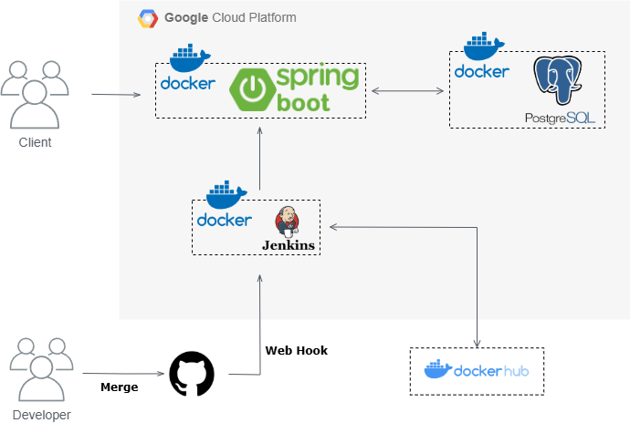
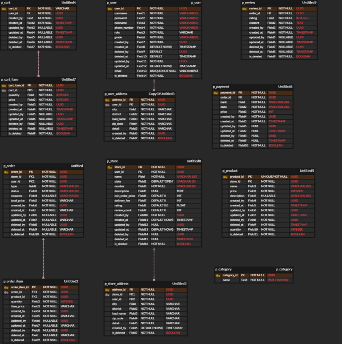
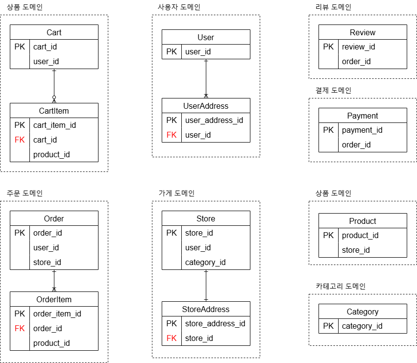

# FlexiRoute

# 프로젝트 목적

- 음식점들의 배달 및 포장 주문 관리, 결제, 그리고 주문 내역 관리 기능을 제공하는 플랫폼 개발
- 모놀리식 아키텍처 구성(Layerd Architecture)
- 추후 MSA 적용을 위해, 각 도메인 간의 의존성과 연관관계를 최소화하여 독립적인 관계를 맺도록 시스템 아키텍처를 설계

<br>

# 서비스 구성 및 실행 방법

### application.yml
```yml
spring:
  profiles:
    active: prod

webclient:
  base-url: {{현재 프로젝트의 base-url}}

---
spring:
  config:
    activate:
     on-profile: prod

  datasource:
    driver-class-name: org.postgresql.Driver
    url: jdbc:postgresql://{{db-host}}/{{database}}
    username: {{username}}
    password: {{password}}

jwt:
  secret:
    key: {{JWT Secret Key}}
  access-token-expiration-time: 3600000  # 1시간 (밀리초 단위)
  refresh-token-expiration-time: 604800000  # 7일 (밀리초 단위)

gemini:
  api:
    key: {{Gemini API Key}}
  request:
    uri: https://generativelanguage.googleapis.com
    path: /v1beta/models/gemini-1.5-flash-latest:generateContent

ai:
  prompt:
    max-length-message: ", 답변을 최대한 간결하게 50자 이하로"

---
spring:
  config:
    activate:
      on-profile: test

  datasource:
    driverClassName: org.h2.Driver
    url: jdbc:h2:mem:testdb;MODE=PostgreSQL;DB_CLOSE_ON_EXIT=TRUE
    username: sa
    password:

gemini:
  api:
    key: testKey
  request:
    uri: https://generativelanguage.googleapis.com
    path: /v1beta/models/gemini-1.5-flash-latest:generateContent

ai:
  prompt:
    max-length-message: ", 답변을 최대한 간결하게 50자 이하로"

jwt:
  secret:
    key: testKeytestKeytestKeytestKeytestKeytestKeytestKe
  access-token-expiration-time: 3600000  # 1시간 (밀리초 단위)
  refresh-token-expiration-time: 604800000  # 7일 (밀리초 단위)

```

<br>

# 시스템 아키텍처



<br>

# 기술 스택

### Backend
 


### Infra
 
 
 

### Cooperation
 
 
 

<br>

# ERD



### ERD 도식화



# API Docs

### [Swagger](http://34.64.236.37:8080/swagger-ui/index.html)

### [API 명세서](https://www.notion.so/teamsparta/API-1982dc3ef5148042bc1cd9e971613a71)

<br>

# 팀원 역할 분담

| 정민수 | 염금성 | 이지언 | 노현지 |
|--------|--------|--------|--------|
|  |  |  ||
| - 팀장<br>- 가게 도메인<br>- 카테고리 도메인<br>- 리뷰 도메인 | - 상품 도메인<br>- 결제 도메인 | - 장바구니 도메인<br>- 주문 도메인<br>- CI/CD |- 회원 도메인<br>- AI 담당|
